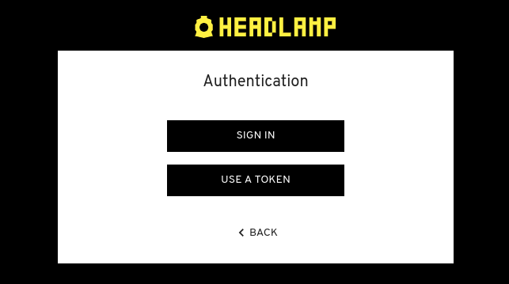

A common use-case for any Kubernetes web UI is to deploy it in-cluster and
set up an ingress server for having it available to users.

We maintain a simple/vanilla [file](https://github.com/kinvolk/headlamp/blob/master/kubernetes-headlamp.yaml)
for setting up a Headlamp deployment and service. Be sure to review it and change
anything you need.

If you're happy with the options in the this deployment file, and assuming
you have a running Kubernetes cluster and your `kubeconfig` pointing to it,
you can run:

```bash
kubectl apply -f https://raw.githubusercontent.com/kinvolk/headlamp/master/kubernetes-headlamp.yaml
```

With this, the Headlamp service should be running, but you still need the
ingress server as mentioned. We provide an example sample ingress yaml file
for this purpose, but you have to manually replace the __URL__ placeholder
with the desired URL (the ingress file also assumes that you have contour
and a cert-manager set up, but if you don't then you'll just not have TLS).

Assuming your URL is `headlamp.mydeployment.io`, getting the sample ingress
file and changing the URL can quickly be done by:

```bash
curl -s https://raw.githubusercontent.com/kinvolk/headlamp/master/kubernetes-headlamp-ingress-sample.yaml | sed -e s/__URL__/headlamp.mydeployment.io/ > headlamp-ingress.yaml
```

and with that, you'll have a configured ingress file, so verify it and apply it:
```bash
kubectl apply -f ./headlamp-ingress.yaml
```

## Accessing using OIDC

Headlamp supports OIDC for cluster users to effortlessly log in using a "Sign in" button.



For OIDC to be used, Headlamp needs to know how to configure it, so you have to provide the different OIDC-related arguments to Headlamp from your OIDC provider. Those are:

 * the client ID: `-oidc-client-id`
 * the client secret: `-oidc-client-secret`
 * the issuer URL: `-oidc-idp-issuer-url`
 * (optionally) the OpenId scopes: `-oidc-scopes`

and you have to tell the OIDC provider about the callback URL, which in Headlamp it is your URL + the `/oidc-callback` path, e.g.:
`https://YOUR_URL/oidc-callback`.

### Scopes

Besides the mandatory _openid_ scope, Headlamp also requests the optional
_profile_ and _email_
[scopes](https://openid.net/specs/openid-connect-basic-1_0.html#Scopes).
Scopes can be overridden by using the `-oidc-scopes` option. Remember to
include the default ones if you need them when using that option.
For example, if you need to keep the default scopes and add Github's `repo`,
then add them all to the option:

  `-oidc-scopes=profile,email,repo`

**Note:** Before Headlamp 0.3.0, a scope _groups_ was also included, as it's
used by Dex and other services, but since it's not part of the default spec,
it was removed in the mentioned version.

### Example: OIDC with Dex

If you are using Dex and want to configure Headlamp to use it for OIDC,
then you have to:

  * Add the callback URL (e.g. `https://YOUR_URL/oidc-callback`) to Dex's `staticClient.redirectURIs`
  * Set `-oidc-client-id` as Dex's `staticClient.id`
  * Set `-oidc-client-secret` as Dex's `staticClient.secret`
  * Set `-oidc-idp-issuer-url` as Dex's URL (same as in `--oidc-issuer-url` in the Kubernetes APIServer)
  * Set `-oidc-scopes` if needed, e.g. `-oidc-scopes=profile,email,groups`
